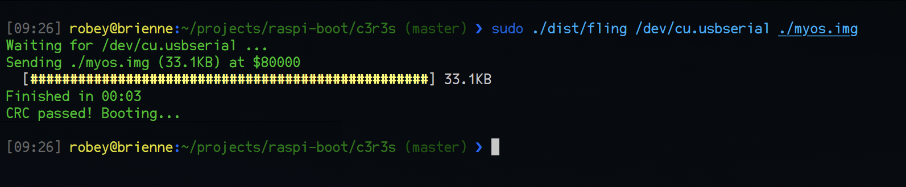

# c3r3s

c3r3s is a tiny (1KB binary) serial bootloader for loading "bare metal" 64-bit kernels on the Raspberry Pi 3. You can iterate on your own kernel code without constantly moving the SD card back and forth.

It's inspired by [raspbootin](https://github.com/mrvn/raspbootin), with these differences:

  - works on raspberry pi 3 (which changed a lot from the 1 and 2)
  - boots directly into 64-bit mode (ARM64 aka aarch64)
  - can load and execute into any address
  - does a CRC-32 check at the end



## How to build

Building the bootloader requires an ARM64 cross-compiler toolchain. These are incredibly fussy to build -- I used the homebrew tap kindly made available by Sergio Benitez [here](https://github.com/SergioBenitez/homebrew-osxct).

You may have to edit the Makefile to indicate where the tools live.

```sh
make c3r3s
```

For your convenience, since the end result is a 1KB binary file, it's included in this repo as `boot/kernel8.img`.

The command-line tool for uploading a kernel is a rust program called "fling". [Make sure you have rust installed.](https://www.rust-lang.org/en-US/install.html)

```sh
make fling
```

## How to use

Make sure you have an SD card with the basic raspberry pi 3 bootloader (https://github.com/raspberrypi/firmware).

Your `config.txt` file needs to have these lines in order to turn on the LED and the serial port:

```
enable_uart=1
dtoverlay=pi3-miniuart-bt
dtoverlay=pi3-act-led
```

Erase any `kernel.img` or `kernel7.img` and add the `kernel8.img` file from c3r3s.

When the raspi boots, the red power LED should start blinking. If you connect a terminal app at 115200 8N1, it should display a spinner saying "c3r3s".

Now use `fling` to send a kernel over the serial port:

```sh
sudo ./dist/fling /dev/cu.usbserial /path/to/your/kernel
```

## How it works

The raspi bootloader loads `kernel8.img` from the SD card to `$8_0000`. c3r3s immediately moves itself down to `$7_fc00` to make room for the real kernel, initializes the UART to 115200bps 8N1, and starts spinning a banner and toggling the red LED every half second, waiting for a wakeup.

Once it starts receiving a kernel, it toggles the LED for every block. If the CRC matches at the end, it sends an OK to the serial port, blinks the LED slowly one last time, and jumps into the downloaded kernel. The x0, x1, and x2 registers are preserved, in case there was anything interesting in them from the raspi bootloader.

fling will exit as soon as a kernel is loaded successfully, so you can launch your terminal app immediately afterward. [tio](https://tio.github.io/) is my favorite. c3r3s waits about one second after sending the OK before launching the next kernel, to give your terminal program time to get ready.

```sh
sudo fling /dev/cu.usbserial /path/to/your/kernel && sudo tio -b 115200 /dev/cu.usbserial
```

## Protocol

The protocol is meant to be dumb and leave all configuration to the host (fling). It should be easy to write your own flinger if you don't like fling.

1. c3r3s will send "c3r3s" to the serial port every 500 milliseconds.
2. host: `boot`
3. c3r3s: `lstn`

c3r3s is now ready to receive a kernel. The kernel must be a multiple of 4 bytes (32-bit word) long.

4. host: `send` followed by:
    - starting address (u32 LE)
    - size (u32 LE)

The host now sends blocks. Each block is:
    - length (u32 LE)
    - data (the number of bytes in length)

After each block, c3r3s writes an ack back:
    - length of total data received so far (u32 LE)

When the entire kernel is sent, the host sends a final checksum:
    - CRC-32 (u32 LE)

c3r3s will respond with `fail` if the CRC didn't match, or `good` if it succeeded.


## License

Apache 2 (open-source) license, included in 'LICENSE.txt'.

Credit and blame: Robey Pointer <robeypointer@gmail.com>

https://github.com/robey/c3r3s
